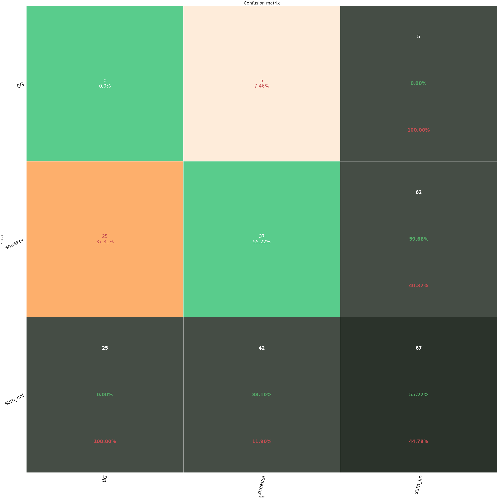

# Détection de Sneakers avec Mask RCNN 


## Description du Projet
Ce projet vise à détecter des sneakers dans des images en utilisant le modèle Mask-RCNN. Le modèle est entraîné pour prédire la présence de sneakers, en générant des masques de détection pour chaque instance détectée.

L'évaluation des performances du modèle est réalisée à l'aide d'une matrice de confusion et de graphiques représentant les pertes d'entraînement et de validation.

## Pré-requis

Repris de la page GitHub officielle : [https://github.com/matterport/Mask_RCNN](https://github.com/matterport/Mask_RCNN)  
Le modèle a été entrainé et testé dans un environnement Docker. Pour une installation facile et rapide, vous pouvez utiliser l'image Docker suivante : [https://github.com/deontaljaard/mrcnn-docker](https://github.com/deontaljaard/mrcnn-docker).

Cette approche permet de configurer rapidement un environnement compatible avec les dépendances et versions nécessaires pour exécuter le modèle Mask R-CNN sans conflit.


### Autres dépendances requises pour les graphiques :
- `seaborn`  
- `scikit-learn`  

Pour installer les dépendances :
```bash
pip install seaborn scikit-learn
```

Les masks d'entraînement sont trop volumineux pour github, ils sont donc disponibles au lien suivant : https://drive.google.com/drive/folders/1EjuueQ5BcQGQNoFnCuvKvUucLQTclE8A

## Annotations 

Nous avons annotés un total de 390 images avec l'outils VIA 2.0.12, 300 images pour le training (250 images contenant des sneakers et 50 n'en contenant pas), 60 images pour la validation (50 vraies, 10 fausses) et 30 pour les tests (25 vraies, 5 fausses). 


## Hyperparamètres

Le modèle a été entraîné avec le jeu d'hyperparamètres suivant :

| Hyperparamètre          | Valeurs utilisées                         |
|-------------------------|-------------------------------------------|
| **Backbone**                       | ResNet-101                     |
| **Optimizer**                      | SGD                            |
| **Taux d'apprentissage (lr)**  | 0.001                              |
| **Steps**              | 250                                      |
| **Epochs**              | 5                                      |
| **Taux de Dropout**        | 0.9                                   |
| **Initialisation des Poids** | mask_rcnn_coco.h5                     |
| **Etapes de validation**               | 50                                        |

## Graphe des Pertes d'Entraînement et de Validation

Le graphique ci-dessous représente la perte (loss) sur l’ensemble d’entraînement et l’ensemble de validation au cours des différentes époques d'entraînement. Ce graphique permet d’évaluer si le modèle présente des signes de surapprentissage (overfitting) ou de sous-apprentissage (underfitting).


Ici, on observe que la perte sur l'ensemble de entraînement est plus élevée que sur l'ensemble de validation jusqu'à l'epoch 3. Par la suite le modèle devient en surapprentissage.

## Matrice de Confusion

La matrice de confusion suivante illustre la performance du modèle sur l’ensemble de test. Elle permet d’évaluer la qualité de la classification en comparant les prédictions du modèle avec les vraies étiquettes des données.



Résumé de la matrice de confusion :
- **Faux Positifs (FP)** : 5
- **Vrais Négatifs (TN)** : 0
- **Faux Négatifs (FN)** : 25
- **Vrais Positifs (TP)** : 37
- **Précision** : 55,22%

### Analyse :
- La **précision** du modèle montre que parmi toutes les prédictions positives faites par le modèle, seulement environ 55,22% étaient correctes. Cela indique que le modèle a une tendance à produire des faux positifs, mais en même temps, il a des difficultés à identifier certains objets.
- Les **5 faux positifs (FP)** suggèrent que le modèle a parfois prédit à tort que des objets étaient présents alors qu'ils ne l'étaient pas, ce qui peut être dû à un seuil de classification trop bas.
- Le **nombre élevé de faux négatifs (FN)**, à savoir **25**, est assez élevé. Cela indique que le modèle manque un nombre important d'objets réellement présents dans les images, ce qui peut être lié à des problèmes de détection ou à un manque de diversité dans le jeu de données.
- Les **37 vrais positifs (TP)** montrent que le modèle est assez bon pour détecter certains objets, mais l'amélioration de la capacité de détection est nécessaire pour augmenter le taux de détection des objets manqués.

### Améliorations possibles :
1. **Réduire les faux négatifs (FN) :**
   - **Augmenter le nombre d'epochs** pourrait aider à entraîner le modèle plus longtemps et à mieux ajuster les poids.
   - Modifier le **seuil de classification** pour les prédictions pourrait réduire le nombre de faux négatifs. Si le seuil est trop strict, le modèle pourrait ignorer certains objets. En réduisant légèrement le seuil, on peut permettre au modèle de détecter davantage d'objets, mais cela pourrait entraîner plus de faux positifs.
   
2. **Réduire les faux positifs (FP) :**
   - **Ajuster le taux d'apprentissage (learning rate)** peut permettre au modèle d'optimiser plus précisément les poids. Un taux d'apprentissage plus faible pourrait aider à mieux converger sans faire de prédictions trop extrêmes.
   - **Améliorer l'architecture du modèle**, par exemple en ajustant les couches du **backbone** (par exemple, passer de ResNet-101 à ResNet-50).

3. **Réévaluation des hyperparamètres :**
   - **Taux de dropout** : Si la précision est faible en raison du sur-apprentissage (overfitting), augmenter le taux de dropout pourrait améliorer la généralisation du modèle.
  - **Taux d'Apprentissage** : Le taux d'apprentissage de 0.001 a permis une convergence rapide tout en maintenant la stabilité de l’entraînement.
  - **Régularisation** : L’ajout d’une régularisation L1 ou L2, ou l’augmentation du dropout, pourrait réduire le surapprentissage en limitant la complexité du modèle.

4. **Améliorer le jeu de données :**
   - Le nombre de **faux négatifs** pourrait également être réduit en améliorant la qualité et la diversité du jeu de données d'entraînement. L'ajout d'exemples plus variés pourrait aider le modèle à mieux généraliser et à détecter des objets dans des contextes plus complexes.

--- 

